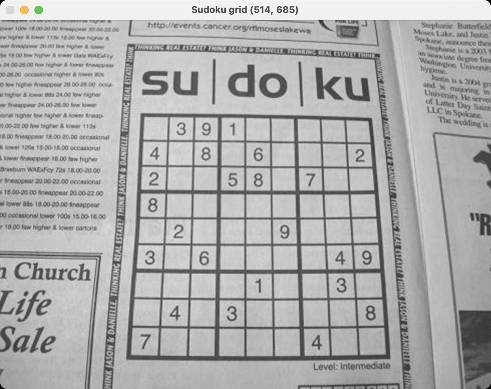
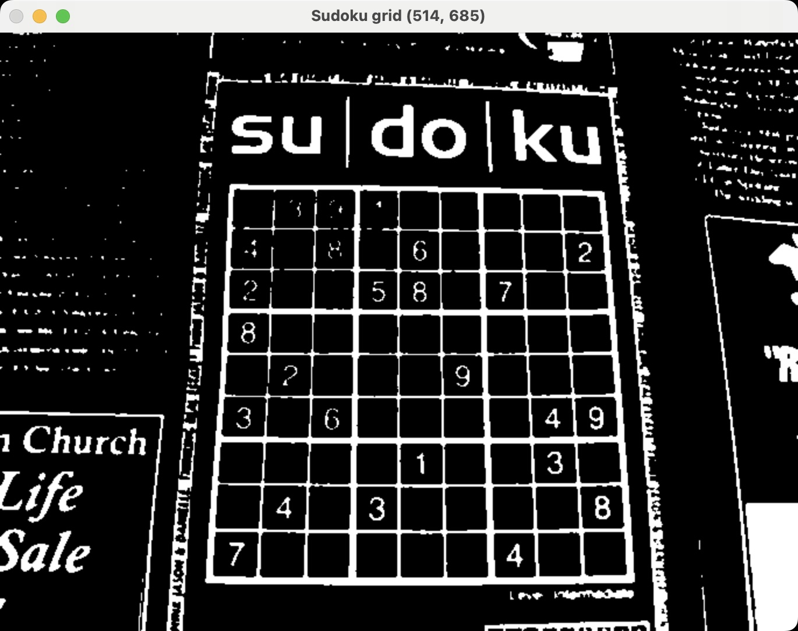
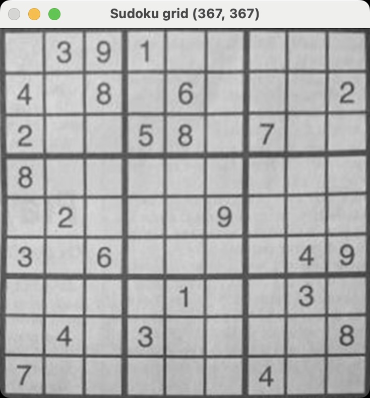
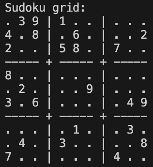
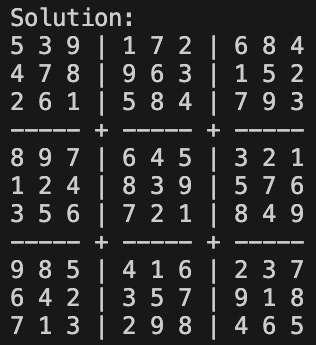

# Sudoku solver
A 9x9 Sudoku puzzle is detected from an image using a CNN trained on the MNIST dataset.
A recursive backtracking algorithm then solves the puzzle.

## Procedure
1. Convert Sudoku image to black and white
2. Detect Sudoku grid and warp the image
3. For each cell on the grid
    1. Extract digit from the cell
    2. Use pre-trained CNN to make prediction about digit
4. Solve Sudoku using backtracking algorithm

## Example use

### Original sudoku grid
Load a picture of a Sudoku grid.

### Grayscale
Convert the colored image to a single grayscale channel for alignment with MNIST digits.

### Binary
Convert the image to black and white to better detect the grid borders.

### Warp
Warp the sudoku grid to fit the frame.

### Detected grid
Extract the Sudoku grid from the image by looping over each cell and predicting its value using the pre-trained CNN.

### Solution
Solve the Sudoku puzzle using a backtracking algorithm.

